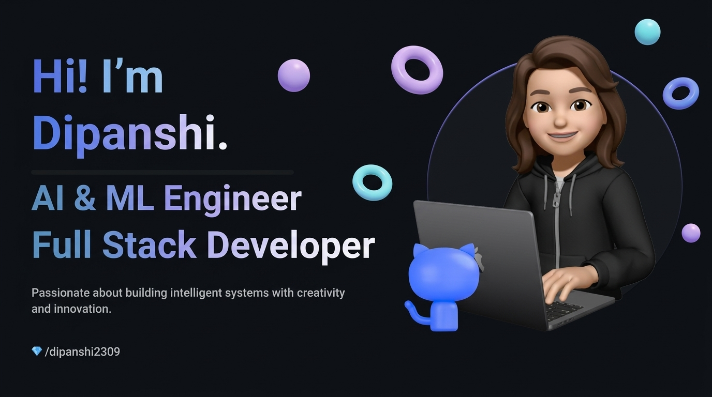

 

<!-- Animated Typing SVG -->

  

## 𝐇𝐞𝐥𝐥𝐨 𝐭𝐡𝐞𝐫𝐞, 𝐟𝐞𝐥𝐥𝐨𝐰 <𝚌𝚘𝚍𝚎𝚛 />! 

> [!CAUTION]
> - 🔖 Welcome to my profile! I am an **AI & Machine Learning Engineer** and **Full-Stack Developer**.

> [!NOTE]
> - 🤖 I’m currently building **Agentic RAG Knowledge Systems** and **Human-in-the-Loop DevOps Assistants**.

> [!IMPORTANT]
> - 🚀 Implementing zero-hallucination verification loops using **Gemini 2.5 Flash**, **LangChain**, and **ChromaDB**.

> [!WARNING]  
> - 🧠 Experienced in **Deep Learning (CNNs / TensorFlow)**, **NLP sentiment mining**, and **MERN Full-Stack applications**.

> [!TIP]  
> - 💬 If you're interested in collaborating or exploring intelligent systems — I'd love to connect!

> 

>  
>  
>  
>  
> 

<h3 align="center">
   
  
  【Ｓｋｉｌｌｓ】
</h3>

 

<!-- Glowing Skills Icons -->

  

 

| Core Languages | AI, LLMs & ML | Web & Frameworks | Databases & DevOps |
| :---: | :---: | :---: | :---: |
|  |  |  |  |
|  |  |  |  |
|  |  |  |  |
|  |  |  |  |
|  |  |  |  |
| [-3776AB?style=flat-square)](https://github.com/dipanshi2309) |  |  | [-326CE5?style=flat-square&logo=kubernetes&logoColor=white)](https://github.com/dipanshi2309) |

<h3 align="center">
   
  
  【Ｐｒｏｊｅｃｔｓ】
</h3>

 

<!-- Interactive Project Cards -->

 

<b>🔍 Click to Expand In-Depth Architecture Details</b>

 

<table align="left" width="100%">
  <tr>
    <td width="50%" valign="top">
      <h3>🤖 Agentic RAG Knowledge Assistant</h3>
      <ul>
        <li><b>Dual-Agent Architecture:</b> Synthesis agent paired with an auditor agent to cross-verify answers against retrieved text, eliminating hallucinations.</li>
        <li><b>Vector Search:</b> <b>ChromaDB</b> with local <b>Sentence-Transformers</b> embeddings.</li>
        <li><b>Multi-Format Ingestion:</b> Structured parsing for PDF (<code>pypdf</code>), Word (<code>python-docx</code>), and Web (<code>beautifulsoup4</code>).</li>
        <li><b>Full-Stack Deployment:</b> Asynchronous <b>FastAPI</b> backend + <b>Redis</b> caching + <b>Streamlit</b> frontend.</li>
      </ul>
    </td>
    <td width="50%" valign="top">
      <h3>🔄 Human DevOps in a Loop</h3>
      <ul>
        <li><b>Specialized Multi-Agent Swarm:</b> Powered by <code>gemini-2.5-flash</code> with <i>Docker Agent</i>, <i>Kubernetes Agent</i>, and <i>GitHub Actions CI/CD Agent</i>.</li>
        <li><b>Risk Assessment:</b> Automated repository inspection via <code>PyGithub</code> with automated risk scoring.</li>
        <li><b>Human Governance:</b> Mandatory human approval gate before triggering deployment actions.</li>
        <li><b>Auditing & PDF:</b> Audit logs in <b>SQLite3</b> (<code>approval.db</code>) and automated report generation via <b>ReportLab</b>.</li>
      </ul>
    </td>
  </tr>
  <tr>
    <td width="50%" valign="top">
      <h3>🎙️ AI Mock Interview Platform</h3>
      <ul>
        <li><b>Full-Stack MERN:</b> <b>React 18</b>, <b>Vite</b>, <b>Tailwind CSS</b>, <b>Node.js</b>, <b>Express</b>, and <b>MongoDB / Mongoose</b>.</li>
        <li><b>AI Feedback Engine:</b> <b>Google Gemini API</b> generates real-time technical questions and qualitative grading.</li>
        <li><b>Analytics:</b> Visual skill telemetry charts using <b>Chart.js</b> and <b>React-Chartjs-2</b>.</li>
      </ul>
    </td>
    <td width="50%" valign="top">
      <h3>🌱 AI Plant Disease Detection</h3>
      <ul>
        <li><b>Deep Learning CNN:</b> Convolutional Neural Network trained with <b>TensorFlow / Keras</b> (<code>plant_disease_model.h5</code>).</li>
        <li><b>Image Pipeline:</b> Ingests leaf photos normalized through <b>Pillow (PIL)</b> and <b>NumPy</b>.</li>
        <li><b>Treatment Advice:</b> Matches predicted classes against <code>disease_info.py</code> to output immediate remediation measures.</li>
      </ul>
    </td>
  </tr>
</table>

 

<h3 align="center">
   
  
  【Ｓｔａｔｓ】
</h3>

 

  

    

  <table border="0">
    <tr>
      <td>
        
      </td>
      <td>
        
      </td>
    </tr>
  </table>

   

  

<h3 align="center">
   
  
  【Ａｃｔｉｖｉｔｙ】
</h3>

 

  <picture>
    <source media="(prefers-color-scheme: dark)" srcset="https://raw.githubusercontent.com/dipanshi2309/dipanshi2309/output/github-contribution-grid-snake-dark.svg">
    <source media="(prefers-color-scheme: light)" srcset="https://raw.githubusercontent.com/dipanshi2309/dipanshi2309/output/github-contribution-grid-snake.svg">
    
  </picture>

 

<!-- Quote Card -->

  

 

  
  

 

  

